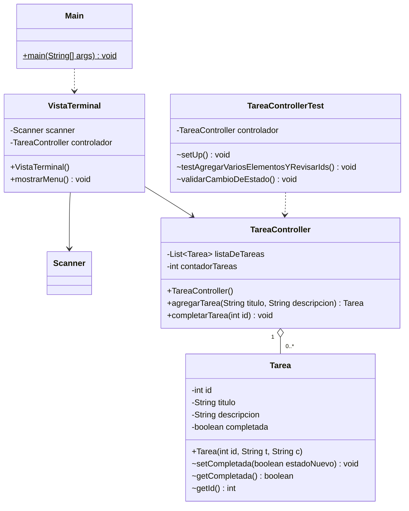

# Diagrama UML

```mermaid
classDiagram
    class Main {
        +main(String[] args) void$
    }

    class VistaTerminal {
        -Scanner scanner
        -TareaController controlador
        +VistaTerminal()
        +mostrarMenu() void
    }

    class TareaController {
        -List~Tarea~ listaDeTareas
        -int contadorTareas
        +TareaController()
        +agregarTarea(String titulo, String descripcion) Tarea
        +completarTarea(int id) void
    }

    class Tarea {
        -int id
        -String titulo
        -String descripcion
        -boolean completada
        +Tarea(int id, String t, String c)
        ~setCompletada(boolean estadoNuevo) void
        ~getCompletada() boolean
        ~getId() int
    }

    class TareaControllerTest {
        -TareaController controlador
        ~setUp() void
        ~testAgregarVariosElementosYRevisarIds() void
        ~validarCambioDeEstado() void
    }

    Main ..> VistaTerminal
    VistaTerminal --> Scanner
    VistaTerminal --> TareaController
    TareaController "1" o-- "0..*" Tarea
    TareaControllerTest ..> TareaController
```

**Visibilidad:** `+` público, `-` privado y `~` de paquete. `$` indica un método estático.
